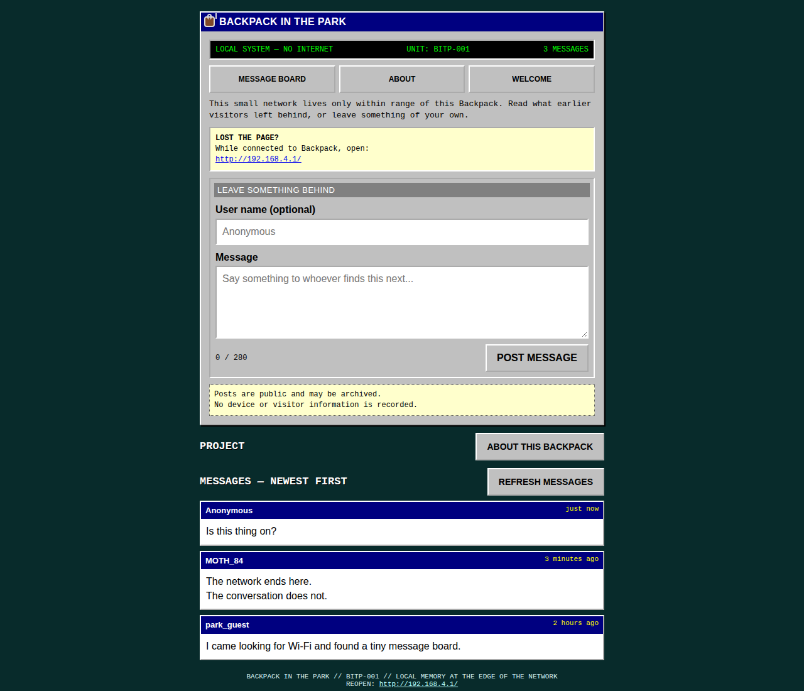
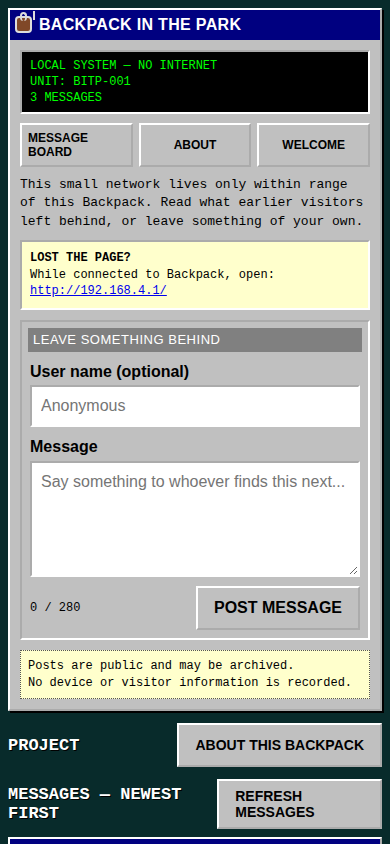

# Backpack In The Park

A tiny, place-bound, anonymous message board for the Raspberry Pi Pico W: part geocache, part low-maintenance digital Tamagotchi.

The Pico creates an open Wi-Fi access point whose canonical `/` page is the message board. A visitor can read or post immediately, open the unit's About page, or visit the optional introduction at `/welcome`. There is no internet connection, account, cookie, analytics package, or participant/device log.

Backpack is a sibling of [Shovel In The Park](https://github.com/SomethingSillyStupid/shovel-in-the-park). Shovel opens directly onto the board; Backpack gives each physical unit a configurable identity and front door.

## Experience

```text
Join the open Wi-Fi network
          ↓
Message board opens at /
          ↓
Read or post immediately
          ↓
Open ABOUT or WELCOME for the unit's story
```

`/` is the canonical message board; `/board` remains a compatibility alias and `/welcome` preserves the configurable introduction. Foreign HTTP hostnames, common captive-network probes, and unknown HTTP routes return to the local root. HTTPS and HSTS requests cannot be transparently redirected: TLS happens before Backpack can send an HTTP response, and the Pico cannot present trusted certificates for arbitrary internet hostnames. A browser connection error for an HTTPS address is therefore a normal captive-portal limitation, not proof that local DNS or HTTP is down.

## Screenshots

<p align="center">
  
  
</p>

<p align="center"><em>Desktop preview and phone-sized captive-portal layout.</em></p>

## Features

- Open, standalone Pico W access point
- Catch-all DNS captive portal using the bundled `phew/` snapshot from [Pimoroni Phew!](https://github.com/pimoroni/phew)
- Board-first canonical root with `/board` compatibility and optional `/welcome`
- Explicit captive probes for Apple, Android/ChromeOS, Windows, and Firefox
- IPv4 catch-all answers; AAAA and HTTPS DNS queries receive clean no-data answers
- Recovery URL shown in the default SSID and on every public page
- Configurable unit name, introduction, portrait, and disclosure
- Configurable offline About page linked from the board
- A project address visitors can save and open after leaving the offline network
- One optional, local, operator-selected welcome image; no public image uploads
- Mobile-first Windows 95/early-network visual language
- Optional pseudonym; blank names become `Anonymous`
- 280 Unicode-character, text-only messages with line breaks
- Newest-first board with 50 messages in RAM by default
- Current-session relative ages
- Latest 20 archived posts restored after reboot by default
- Restored posts honestly labeled `EARLIER SESSION` and visually de-emphasized
- Append-only JSONL archive with power-loss recovery and a size ceiling
- Unlinked operator page for archive download and explicit deletion
- No Phew request log; stale `log.txt` is removed at startup

## Privacy contract

Backpack stores only the words participants knowingly submit plus the configured board ID, a boot counter, and seconds since boot. It does **not** retain MAC addresses, IP addresses, user agents, cookies, visit records, analytics, acknowledgment state, or device fingerprints.

Posts are visible to everyone connected to the access point and may be archived for later art projects. The operator path is unlinked and configurable, but it is not strong authentication: the network uses open Wi-Fi and HTTP.

## Files on the Pico

```text
/
├── main.py
├── board.py
├── config.py
├── captive_portal.py      # AP DNS and host-aware HTTP routing
├── request_policy.py
├── archive.jsonl          # created after the first post
├── boot.id / boot.id.tmp  # alternating non-personal boot-counter slots
├── phew/                  # bundled, bounded Phew snapshot
└── static/
    ├── welcome.html
    ├── welcome.svg
    ├── about.html
    ├── index.html
    └── admin.html
```

`preview_server.py`, `tests/`, and `docs/` are development files and do not go on the Pico.

## Configure a unit

Edit `config.py` before deployment:

```python
SSID = "BACKPACK-001 OPEN 192.168.4.1"
BOARD_NAME = "BACKPACK IN THE PARK"
BOARD_ID = "BITP-001"

WELCOME_TITLE = "BACKPACK IN THE PARK"
WELCOME_STATUS = "YOU HAVE DISCOVERED A LOCAL NETWORK"
WELCOME_PARAGRAPHS = (
    "This small network lives only within range of this object.",
    "It remembers what nearby visitors tell it.",
)
WELCOME_BUTTON_LABEL = "ENTER MESSAGE BOARD"
WELCOME_DISCLOSURE = "Messages are public and may be archived."

WELCOME_IMAGE_PATH = "static/welcome.svg"
WELCOME_IMAGE_MIME = "image/svg+xml"
WELCOME_IMAGE_ALT = "A small Backpack In The Park field unit"

ABOUT_TITLE = "ABOUT THIS BACKPACK"
ABOUT_STATUS = "LOCAL ARTIFACT // NO INTERNET REQUIRED"
ABOUT_PARAGRAPHS = (
    "This unit has its own configurable story.",
    "It stores messages, but never stores visitor or device information.",
)
ABOUT_PROJECT_LABEL = "PROJECT NOTES / BUILD YOUR OWN"
ABOUT_PROJECT_URL = "https://github.com/SomethingSillyStupid/backpack-in-the-park"
ABOUT_RETURN_LABEL = "RETURN TO MESSAGE BOARD"

ADMIN_PATH = "/operator-change-this-for-each-unit"
```

Configured text is HTML-escaped. Use plain text, not markup or JavaScript.

The About page is available at `/about` and linked from the message board. Its
project URL is displayed with a reminder to save it for later: external sites
cannot load until the visitor disconnects from Backpack's offline network.
Only `http://` and `https://` project URLs are rendered; unsafe schemes are
discarded.

Use a unique `SSID`, `BOARD_ID`, portrait, and hard-to-guess `ADMIN_PATH` for each physical unit. Keep `192.168.4.1` visible in the SSID unless you deliberately change the AP address; it remains discoverable in Wi-Fi settings after the browser tab closes. **Changing the published example operator path before field deployment is mandatory.** SSIDs may contain ordinary spaces and punctuation but must not exceed 32 UTF-8 bytes.

### Change or remove the welcome image

The included SVG is a small default portrait. For a photograph, copy an optimized JPEG into `static/` and update:

```python
WELCOME_IMAGE_PATH = "static/moth-unit-003.jpg"
WELCOME_IMAGE_MIME = "image/jpeg"
WELCOME_IMAGE_ALT = "Moth Unit 003 beside a stand of trees"
```

Recommended image budget:

- 320–800 pixels on the longest side
- Under 100 KiB preferred; 150 KiB maximum
- JPEG for photographs, PNG or SVG for simple artwork

The firmware uses Phew's `FileResponse`, which sends files in 1 KiB chunks instead of loading the whole image into Pico RAM. Set `WELCOME_IMAGE_PATH = None` for a deliberately text-only welcome page; no broken image is shown.

## Message memory across reboots

Backpack restores the latest archived posts on startup:

```python
RESTORE_MESSAGES_ON_BOOT = True
RESTORE_MESSAGE_COUNT = 20
RESTORED_TIME_LABEL = "EARLIER SESSION"
MAX_MESSAGES = 50
```

A Pico without an RTC cannot know how long it was powered off, so restored posts never display an invented age. They receive the non-temporal `EARLIER SESSION` label and a muted visual treatment. New posts use honest relative ages from the current boot.

Restoration scans the archive while retaining only the configured number of records in RAM. Restored posts are **not** appended again, so repeated reboots do not duplicate archive entries. New posts eventually evict the oldest visible restored posts when the RAM limit is reached.

Deleting the archive leaves the current in-memory board alone. After the next reboot, there is nothing to restore.

## Install on a Pico W

1. Flash current Raspberry Pi Pico W MicroPython firmware.
2. Copy these project files to the root of the Pico filesystem:

   ```text
   main.py
   board.py
   config.py
   captive_portal.py
   request_policy.py
   phew/
   static/welcome.html
   static/welcome.svg       # or your configured image
   static/about.html
   static/index.html
   static/admin.html
   ```

3. Disconnect any serial REPL session and reset the Pico.
4. On every firmware update, disconnect and rejoin the configured SSID so the device receives Backpack's local DNS setting through DHCP. Forgetting and re-adding the network is the most reliable way to clear a stale lease.
5. The message board should appear immediately. If it does not, open `http://192.168.4.1/`; `/board` remains an alias and the longer introduction remains at `/welcome`.
6. Test the catch-all with an explicitly HTTP address such as `http://neverssl.com/`; it should redirect to the local root board. Modern browsers often upgrade ordinary names to HTTPS, which will fail before an HTTP redirect is possible. Use `http://192.168.4.1/` as the guaranteed recovery address.
7. Use the exact private `ADMIN_PATH` to download or delete the archive.

`captive_portal.py` configures the AP to advertise its own IP as DNS, applies the canonical-host redirect to every named HTTP route, registers the explicit captive-probe paths, and builds bounded query-type-aware DNS responses. Standard IN/A queries, including a valid EDNS OPT record, receive the local AP address; AAAA, HTTPS, and other query types receive a valid no-data response. Response flags preserve only the client's recursion-desired bit and do not advertise recursion; malformed, non-query, or structurally inconsistent packets are ignored. HTTPS and HSTS requests cannot be transparently redirected because certificate validation happens before the Pico can return an HTTP response.

The bundled Phew snapshot is based on Pimoroni commit `751c40458d6cb954a747fcf494b7326a586ab084`. Its server and DNS modules have tested local transport patches: request lines are limited to 512 bytes, header lines to 1 KiB, all headers to 4 KiB and 32 fields, and request bodies to 4 KiB; DNS packets are capped by the existing 256-byte receive and parsed structurally before a response is built. The server rejects multipart forms, oversized declarations, truncated bodies, and malformed URL encoding before form parsing, protecting Pico RAM and keeping bad requests fail-closed. Pimoroni's MIT license remains under `phew/LICENSE`.

## Archive format

Each line is an independent JSON record:

```json
{"board":"BITP-001","boot":3,"posted_at":1842,"user":"Anonymous","message":"I saw a fox."}
```

`posted_at` means seconds since that boot, not a date. On startup, an incomplete final line from a power loss is removed before new records are appended. The archive stops growing at 512 KiB by default; posting continues in RAM if storage is full or unavailable.

Downloading never deletes anything. Deletion requires typing `DELETE` exactly on the operator page and does not clear the live board.

## Local preview and tests

The desktop preview uses separate data under `preview-data/`, applies the same bounded URL-encoded request-body policy as the firmware, and requires only Python 3:

```bash
python3 preview_server.py --host 0.0.0.0 --port 8765
```

Open `http://localhost:8765/` for the board, `/welcome` for the optional introduction, `/board` for the compatibility alias, and `/about` for the per-device project story.

Run the tests and lint checks with:

```bash
python3 -m unittest discover -s tests -v
ruff check .
```

The preview verifies application behavior and responsive presentation. It does not prove the Pico's radio, captive-portal detection, MicroPython runtime, or flash behavior; verify those on the target board before field deployment.

## Power in the field

Use a USB battery pack that supports always-on or low-current loads. Many consumer packs shut off unexpectedly. For solar installations, use a proper charge controller and protected battery rather than assuming a USB bank supports continuous pass-through charging.

## License

MIT. Copy it, fork it, modify it, exhibit it, or let a series of little network creatures collect language in the park. Preserve the license notice, and do not blame the authors if the shrubbery develops a personality.
